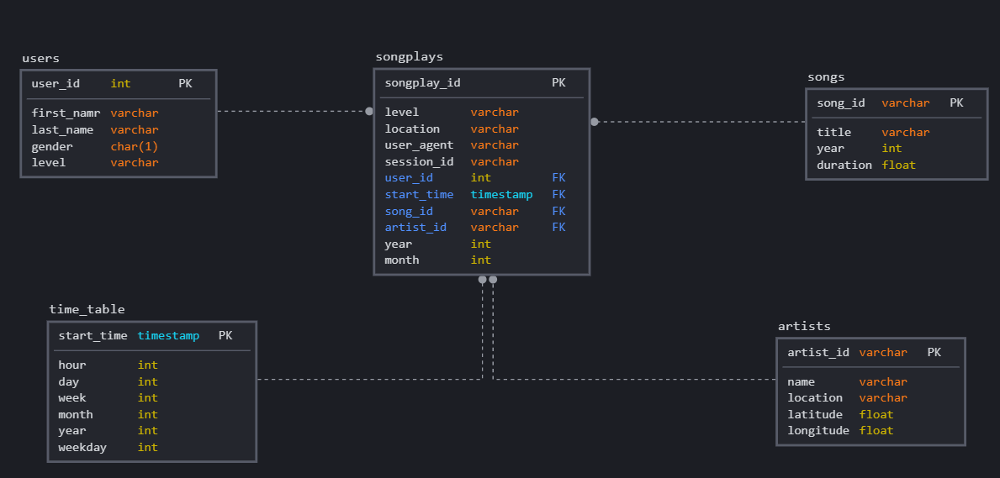
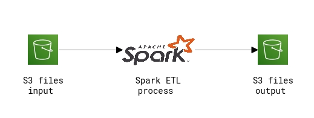

## Discussion

### Project Purpose

The Sparkify company has grown in the last years and they need move their data warehouse to a data lake. The purpose of this project is build an ETL pipeline that extract data from S3, processes them using Spark, and loads the data back into S3 as a set of dimensional tables.

### Database Schema

The project was built based on the star architecture. There are 4 dimension tables: **users** **, ** **songs**, **artistis ** and **time **, the 4 tables refer to the entities of our business model, there is also a fact table called **songplays ** that allows a performatic queries, without the use of JOINs. **Songplays** table contains the data of a specific song played, its user and artist.

## Project structure

### Files 

- **etl.py**: This script is responsible for run ETL Process;
- **dl.cfg**: This file stores the AWS connection configurations.

### ETL Process

The data are retrieved from the S3 buckets, them the json files are processed by spark cluster and stored into S3 bucket as a set of dimensional tables.

### How To Run

To run the project, follow the steps: 

- Create Redshift Cluster and modify the dwh.cfg file to your cluster variables;
- Run **create_tables.py** to create the staging, dimension and fact tables.
- Run **etl.py** to copy the data from S3 buckets to Redshift staging tables and insert the data from staging tables to dimension and fact tables thought ETL process.